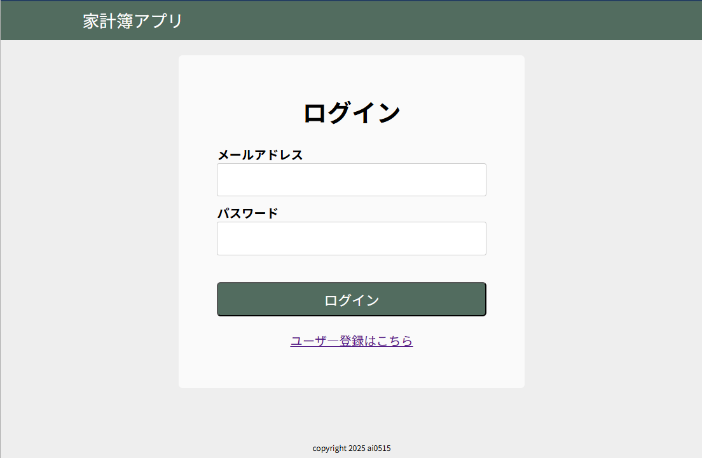
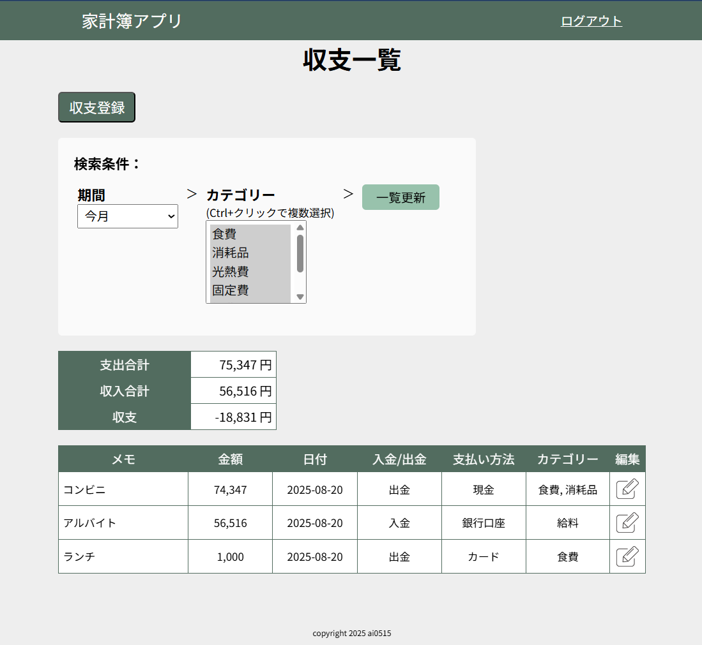
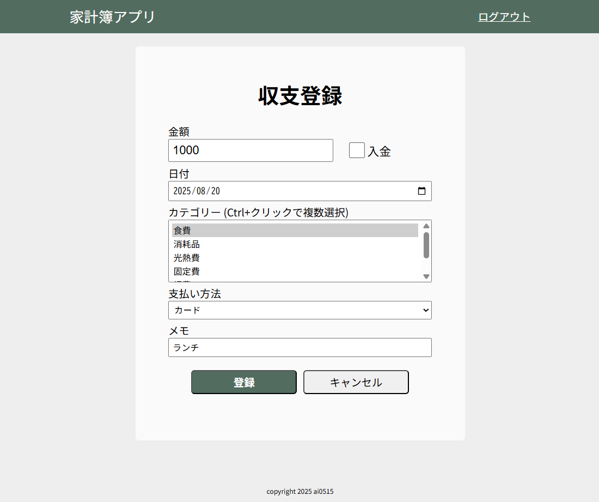

Laravelで作成した家計簿アプリです。

## 概要
* ユーザー登録を行うことで、収入・支出データの「新規登録」「編集」「削除」が可能です。
* 登録したデータは一覧画面にリスト形式で表示され、期間とカテゴリーで絞り込みができます。
* 一覧画面では、収入と支出の合計金額を集計して表示します。

## 開発環境
- **Framework**: Laravel 12.22
- **Language**: PHP 8.2
- **Database**: MySQL 5.7
- **Frontend**: Blade, Livewire
- **その他**: Composer

## セットアップ手順

#### 1. リポジトリをクローン
```bash
git clone https://github.com/ai0515/laravel-expense-tracker.git
cd laravel-expense-tracker
```
#### 2. 依存パッケージをインストール
```bash
composer install
```
#### 3. 環境ファイルをコピー
```bash
cp .env.example .env
```
#### 4. アプリケーションキーを生成
```bash
php artisan key:generate
```
　※.env ファイル内の DB接続情報 を環境に合わせて編集してください。

#### 5. マイグレーションとシーディングを実行
```bash
php artisan migrate --seed
```
#### 6. 開発サーバーを起動
```bash
php artisan serve
```
#### 7. ブラウザで [http://localhost:8000/transactions/](http://localhost:8000/transactions/) にアクセス
　ログイン画面が表示されます。

 ## スクリーンショット例

#### ログイン画面


画面下の「ユーザー登録はこちら」から、ユーザー登録することができます。

または、下記のデモ用ユーザーでログインすることも可能です。
* メールアドレス：test@example.com
* パスワード：password

#### データ一覧画面


ログインすると、ユーザーの登録済みの収入／支出データが一覧表示されます。
* 検索条件を変更：期間・カテゴリーを変更後に「一覧更新」ボタン押下で一覧表示が更新されます。
* データの編集：各項目の右にある編集アイコン押下で、編集画面を表示します。
* データの新規登録：画面左上の「収支登録」ボタン押下で、新規登録画面を表示します。

#### 新規登録画面
